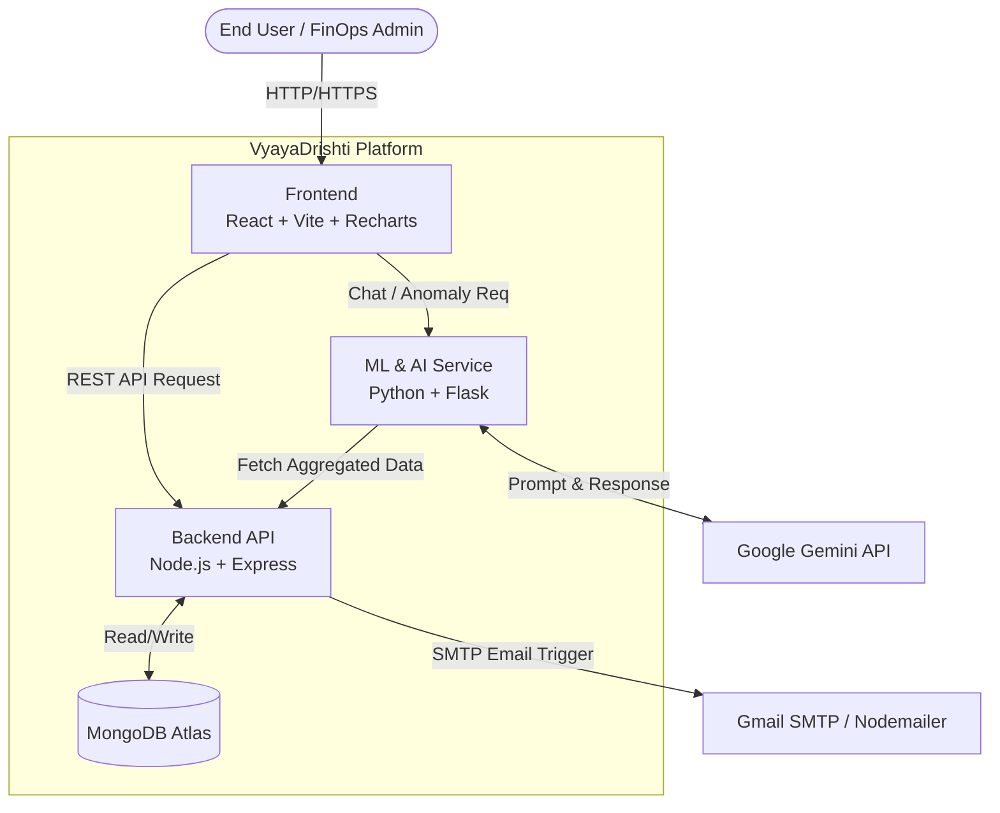
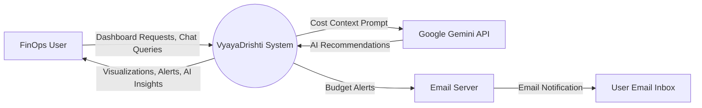
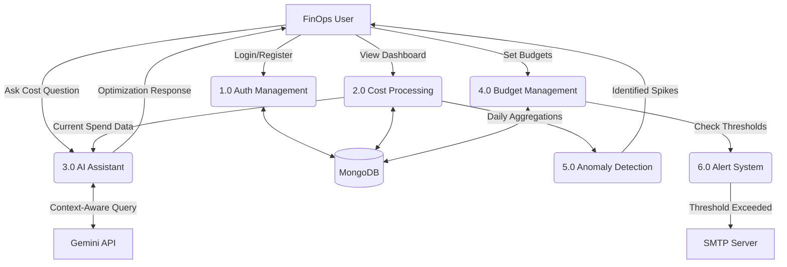
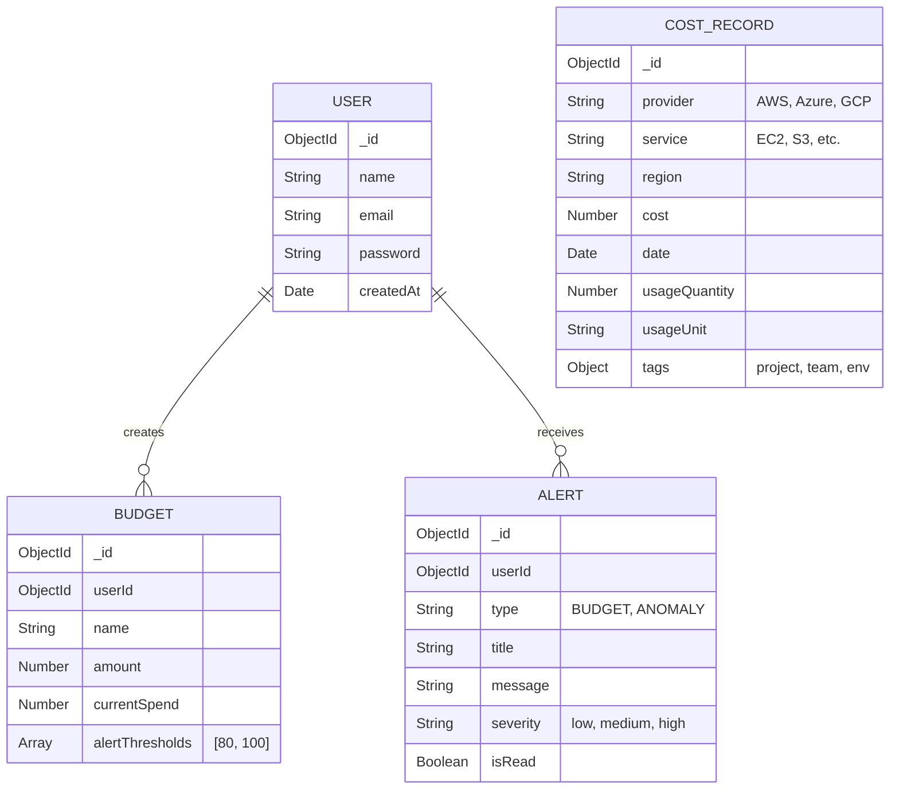
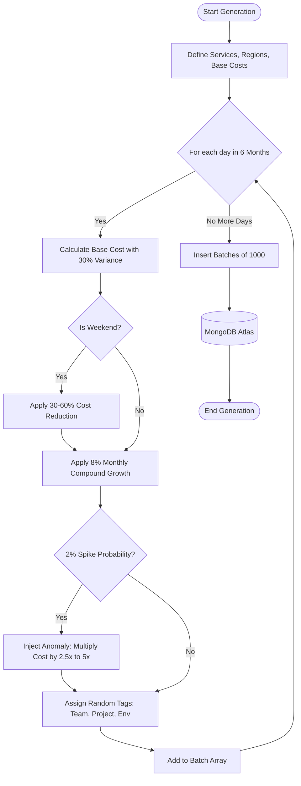
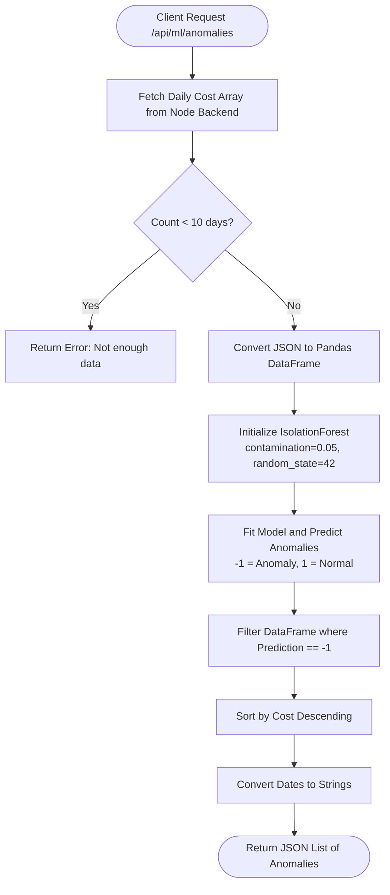
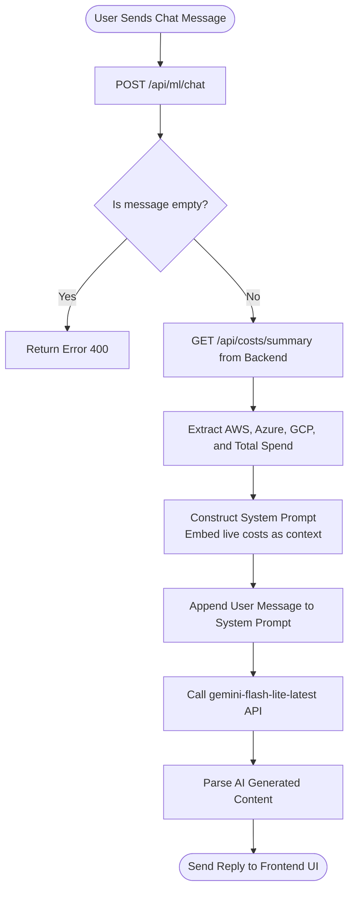
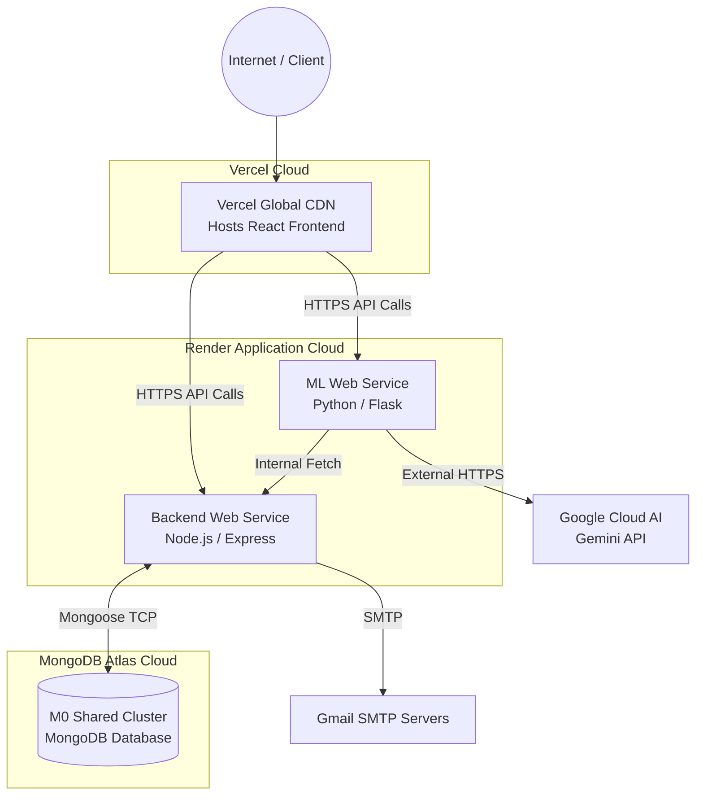

<div align="center">

# VyayaDrishti

### Multi-Cloud Cost Monitoring Dashboard — Cloud FinOps

[](https://vyayadrishti.vercel.app)
[](https://github.com/kripinya/Multi-Cloud-Cost-Monitoring-Dashboard-Cloud-FinOps-)

**VyayaDrishti** (व्ययदृष्टि — *"Expenditure Insight"*) is an AI-powered FinOps platform that consolidates billing data across **AWS, Azure, and GCP** into a single, unified dashboard. It leverages **Machine Learning** (Isolation Forest) for anomaly detection, **Agentic AI** (Google Gemini) for conversational cost optimization, and **automated email alerts** for budget overrun notifications.

---

</div>

## Architecture

```
┌────────────────────────────────────────────────────────────────────┐
│                        VyayaDrishti Platform                       │
├──────────────┬──────────────────────┬──────────────────────────────┤
│   Frontend   │   Backend API        │   ML / AI Service            │
│   (Vercel)   │   (Node.js/Express)  │   (Python/Flask)             │
│              │                      │                              │
│  React 18    │  REST API            │  Isolation Forest            │
│  Vite        │  JWT Auth            │  (Anomaly Detection)         │
│  Recharts    │  Mongoose ODM        │                              │
│  Lucide      │  Nodemailer          │  Google Gemini API           │
│              │  (Email Alerts)      │  (AI Chat Assistant)         │
├──────────────┴──────────────────────┴──────────────────────────────┤
│                        MongoDB Atlas (Cloud)                       │
├───────────────────────────────────────────────────────────────────-┤
│                    Docker Compose (Containerized)                   │
└────────────────────────────────────────────────────────────────────┘
```

---

## Key Features

### Dashboard Overview
- **4 Live Metric Cards** — Total Spend, AWS, Azure, GCP with real-time data from MongoDB
- **6-Month Cost Trend** — Grouped bar chart by provider using Recharts
- **Provider Breakdown** — Instant visibility into per-cloud spending

### Cost Explorer
- **Service Breakdown Table** — Every cloud service ranked by cost with visual progress bars
- **Provider Filter** — Toggle between All / AWS / Azure / GCP
- **Region Analysis** — Cost distribution across data center locations

### Budget Management
- **Budget Cards** — Current spend vs. limit for each budget
- **Color-coded Progress** — Green (safe) → Amber (warning at 80%) → Red (critical at 100%)
- **Automated Email Alerts** — Nodemailer-powered Gmail notifications when thresholds are crossed

### AI Chat Assistant (Google Gemini)
- **Conversational Cost Optimization** — Ask questions like *"How can I reduce my AWS spend?"*
- **Context-Aware Responses** — The AI reads your live cost data before responding
- **Actionable Recommendations** — Specific, provider-level optimization advice

### ML Anomaly Detection (Isolation Forest)
- **Unsupervised Learning** — Trains on historical billing data to detect cost spikes
- **Automatic Flagging** — Anomalous spending days are surfaced with severity scores
- **Zero Configuration** — No manual threshold tuning required

### Forecasts
- **Historical Line Chart** — Actual spend over the last 6 months
- **3-Month Projections** — Dashed forecast line with 5% monthly growth model

### Authentication & Security
- **JWT-based Login/Signup** — Secure token-based authentication
- **Protected Routes** — Dashboard pages require valid token
- **Auto-attach Token** — Axios interceptor adds `Authorization` header to every API call

### Settings
- **Profile Display** — User info decoded from JWT
- **Connected Providers** — AWS, Azure, GCP connection status
- **Danger Zone** — Logout with token clearing

### Email Notifications
- **Gmail SMTP via Nodemailer** — Automated budget alert emails
- **Beautiful HTML Templates** — Dark-themed, branded email with utilization bar
- **Per-User Delivery** — Alerts sent to the logged-in user's registered email address

---

## Tech Stack

| Layer | Technology |
|---|---|
| **Frontend** | React 18, Vite, Recharts, Lucide Icons |
| **Backend** | Node.js, Express.js, Mongoose ODM |
| **Database** | MongoDB Atlas (Cloud) |
| **Auth** | JWT (JSON Web Tokens), bcrypt.js |
| **ML Service** | Python 3.12, Flask, scikit-learn (Isolation Forest) |
| **AI Chat** | Google Gemini API (`gemini-flash-lite-latest`) |
| **Email** | Nodemailer (Gmail SMTP) |
| **DevOps** | Docker, Docker Compose, Nginx |
| **Deployment** | Vercel (Frontend), Render (Backend API + ML Service) |

---

## Project Structure

```
Multi-Cloud-Cost-Monitoring-Dashboard-Cloud-FinOps-/
│
├── frontend/                        # React + Vite Frontend
│   ├── src/
│   │   ├── api/axios.js             # Centralized Axios instance with JWT interceptor
│   │   ├── components/
│   │   │   ├── auth/                # ProtectedRoute (route guard)
│   │   │   ├── charts/              # CostChart, AnomalyChart (Recharts)
│   │   │   ├── layout/              # Sidebar, Header
│   │   │   └── ui/                  # MetricCard, reusable UI components
│   │   ├── pages/
│   │   │   ├── Auth/                # Login, Signup
│   │   │   ├── Dashboard/           # Overview with live metric cards + charts
│   │   │   ├── CostExplorer/        # Filterable cost-by-service table
│   │   │   ├── Budgets/             # Budget cards with progress bars
│   │   │   ├── Alerts/              # Color-coded alert list
│   │   │   ├── Forecasts/           # Line chart with 3-month projections
│   │   │   ├── Chat/                # AI Chat Assistant (Gemini)
│   │   │   └── Settings/            # Profile, providers, logout
│   │   ├── App.jsx                  # Root component with routing
│   │   └── index.css                # Theme + custom CSS variables
│   ├── Dockerfile                   # Multi-stage build (Node → Nginx)
│   ├── nginx.conf                   # Reverse proxy config
│   └── package.json
│
├── server/                          # Express.js Backend
│   ├── src/
│   │   ├── config/db.js             # MongoDB Atlas connection
│   │   ├── controllers/             # Route handlers (auth, costs, budgets, alerts)
│   │   ├── middleware/auth.js        # JWT verification middleware
│   │   ├── models/                  # Mongoose schemas (User, CostRecord, Budget, Alert)
│   │   ├── routes/                  # API route definitions
│   │   ├── services/emailService.js # Nodemailer email alert service
│   │   └── index.js                 # Express app entry point
│   ├── seed/                        # Database seeding scripts (3,300+ records)
│   ├── Dockerfile
│   └── package.json
│
├── ml-service/                      # Python ML + AI Service
│   ├── app.py                       # Flask app (Anomaly Detection + Gemini Chat)
│   ├── requirements.txt             # Python dependencies
│   └── Dockerfile
│
├── docker-compose.yml               # Multi-container orchestration
├── render.yaml                      # Render deployment blueprint
└── README.md
```

---

## Getting Started

### Prerequisites
- **Docker & Docker Compose** (recommended)
- Node.js v18+ and npm (for manual setup)
- Python 3.12+ (for ML service)
- MongoDB Atlas account

### Option A: Docker (Recommended — One Command)

```bash
# 1. Clone the repository
git clone https://github.com/kripinya/Multi-Cloud-Cost-Monitoring-Dashboard-Cloud-FinOps-.git
cd Multi-Cloud-Cost-Monitoring-Dashboard-Cloud-FinOps-

# 2. Create the server/.env file (see Environment Variables below)

# 3. Seed the database
cd server && npm install && npm run seed && cd ..

# 4. Build and run all services
docker compose build && docker compose up -d
```

The app will be live at:
| Service | URL |
|---|---|
| **Frontend** | http://localhost:3000 |
| **Backend API** | http://localhost:4000 |
| **ML Service** | http://localhost:5001 |

### Option B: Manual Setup

```bash
# Backend
cd server
npm install
npm run seed   # Seed MongoDB with 3,300+ billing records
npm run dev    # Starts on http://localhost:4000

# ML Service (new terminal)
cd ml-service
pip install -r requirements.txt
python app.py  # Starts on http://localhost:5001

# Frontend (new terminal)
cd frontend
npm install
npm run dev    # Starts on http://localhost:5173
```

### Environment Variables

Create a `server/.env` file:

```env
PORT=4000
MONGODB_URI=your_mongodb_atlas_connection_string
JWT_SECRET=your_secret_key_here
GEMINI_API_KEY=your_google_gemini_api_key

# Email Notifications (Optional)
EMAIL_USER=your_gmail@gmail.com
EMAIL_APP_PASSWORD=your_16_char_app_password
```

---

## API Endpoints

### Authentication
| Method | Endpoint | Description |
|---|---|---|
| POST | `/api/auth/signup` | Register a new user |
| POST | `/api/auth/login` | Login and receive JWT token |

### Cost Data
| Method | Endpoint | Description |
|---|---|---|
| GET | `/api/costs/summary` | Total + per-provider spend (current month) |
| GET | `/api/costs/daily` | Daily cost data (filterable by provider, date range) |
| GET | `/api/costs/by-service` | Cost breakdown by service |
| GET | `/api/costs/by-provider` | Cost breakdown by provider |
| GET | `/api/costs/by-region` | Cost breakdown by region |
| GET | `/api/costs/trend` | Monthly trend data (default: 6 months) |

### Budgets & Alerts
| Method | Endpoint | Description |
|---|---|---|
| GET | `/api/budgets` | List all budgets with email alert triggers |
| GET | `/api/alerts` | List all alerts |

### ML / AI Service
| Method | Endpoint | Description |
|---|---|---|
| GET | `/api/ml/anomalies` | Detect cost anomalies via Isolation Forest |
| POST | `/api/ml/chat` | AI Chat powered by Google Gemini |

---

## Data Architecture

VyayaDrishti uses a programmatic **Seed Generator** to simulate 6 months of realistic billing data across 18 core services from 3 cloud providers.

### Simulated Cloud Services

| AWS | Azure | GCP |
|---|---|---|
| EC2 (Compute) | Virtual Machines | Compute Engine |
| S3 (Storage) | Blob Storage | Cloud Storage |
| RDS (Database) | SQL Database | BigQuery |
| Lambda (Serverless) | Functions | Cloud Functions |
| CloudFront (CDN) | AKS (Kubernetes) | GKE (Kubernetes) |
| EKS (Kubernetes) | Cosmos DB (NoSQL) | |
| DynamoDB (NoSQL) | | |

### Data Realism Algorithms
| Pattern | Description |
|---|---|
| **Baseline Variance** | ±30% daily cost fluctuation |
| **Weekend Drop-off** | 30–60% cost reduction on weekends |
| **Monthly Growth** | 8% compound month-over-month increase |
| **Anomaly Spikes** | 2% probability of 2.5x–5x cost multiplication |

> These patterns are specifically designed to train the **Isolation Forest ML model** to detect real anomalies.

---

## Architecture & Flow Diagrams

### Overall Architecture


### Data Flow Diagram (Level 0)


### Data Flow Diagram (Level 1)


### Database / Data Model


### Synthetic Billing Data Generation Pipeline


### Isolation Forest Anomaly Detection Pipeline


### Gemini AI Assistant Processing Flow


### Deployment Architecture


---

## Roadmap

- [x] Backend API (Express + MongoDB)
- [x] JWT Authentication (Login/Signup)
- [x] Database Seeding (6 months, 3,300+ records)
- [x] Frontend Dashboard with live data
- [x] Cost Explorer with provider filters
- [x] Budgets & Alerts pages
- [x] Forecasts with 3-month projections
- [x] Settings & Logout
- [x] Docker Compose (multi-container orchestration)
- [x] ML Anomaly Detection (Python + Isolation Forest)
- [x] AI Chat Assistant (Google Gemini API)
- [x] Email Alert Notifications (Nodemailer + Gmail)
- [x] Vercel Deployment (Frontend)
- [x] Render Deployment (Node.js Backend + Python ML Service)
- [ ] Real CSP billing API integration (AWS Cost Explorer, Azure Cost Management, GCP Billing)

---

## Team

**Ananya Karn** — [@kripinya](https://github.com/kripinya)

---

## License

This project is open source and available under the [MIT License](LICENSE).
