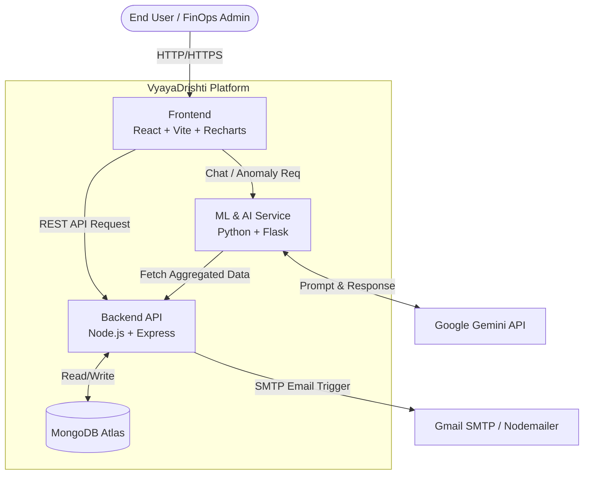
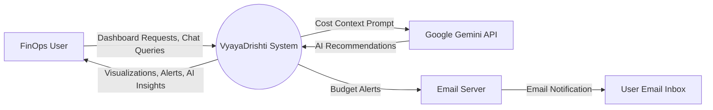
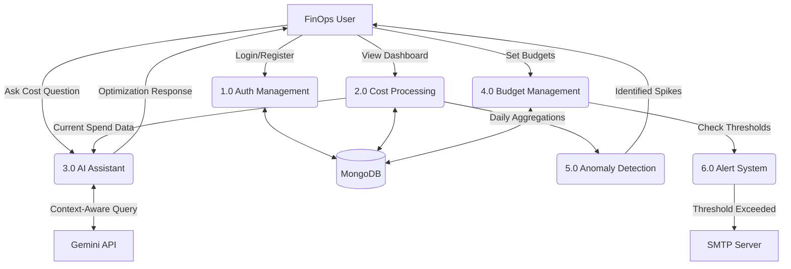
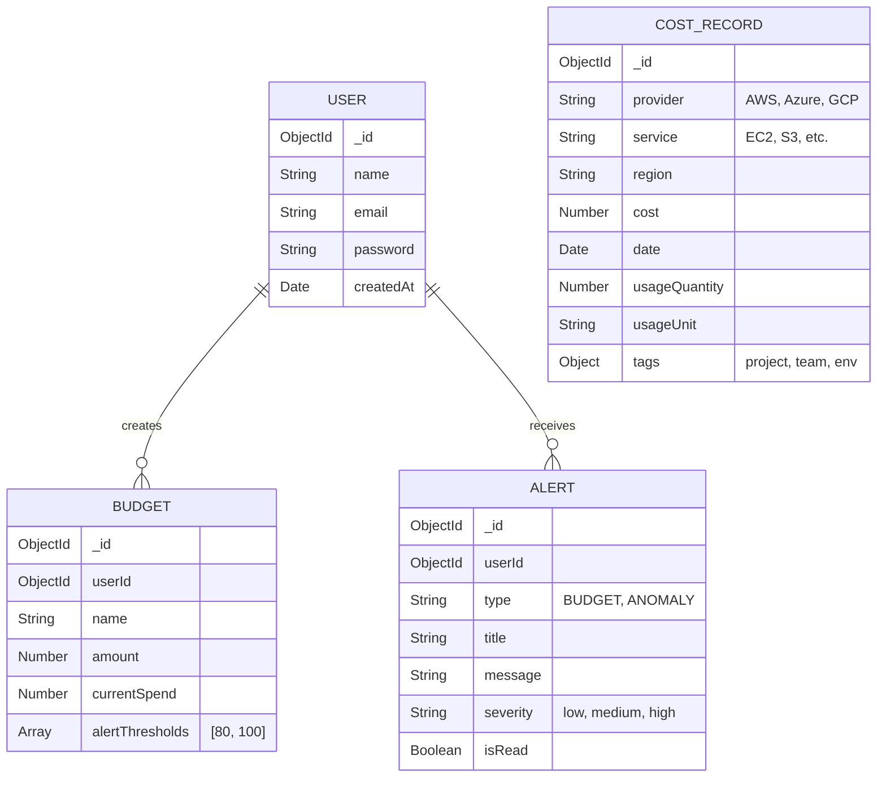
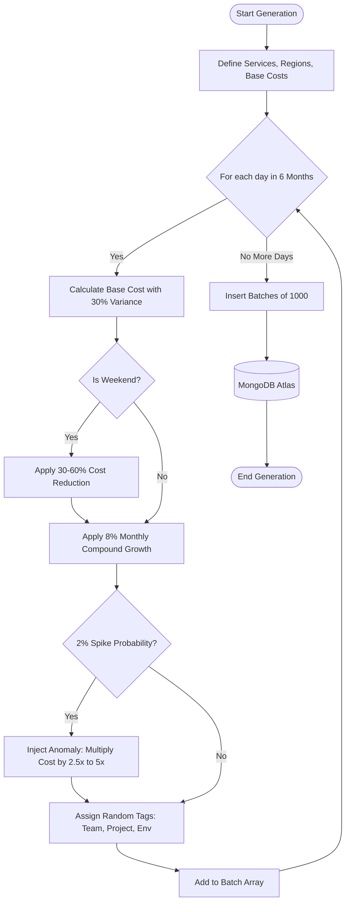
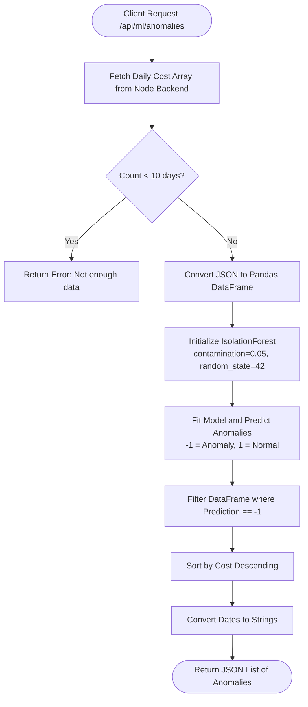
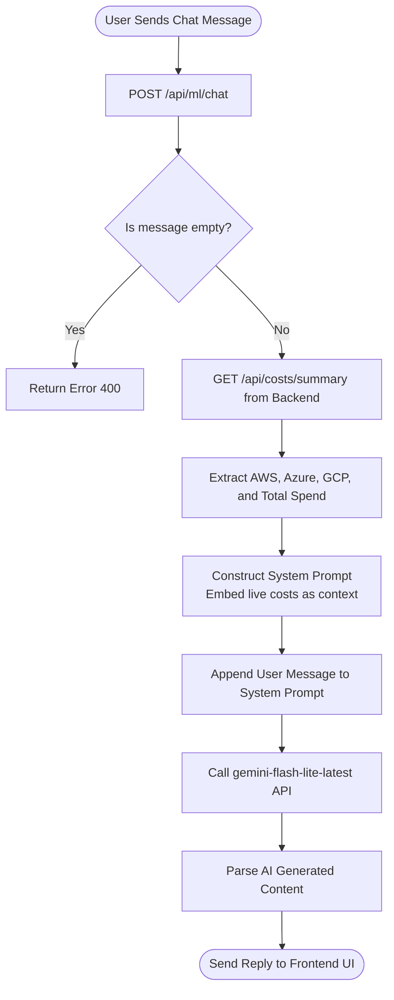
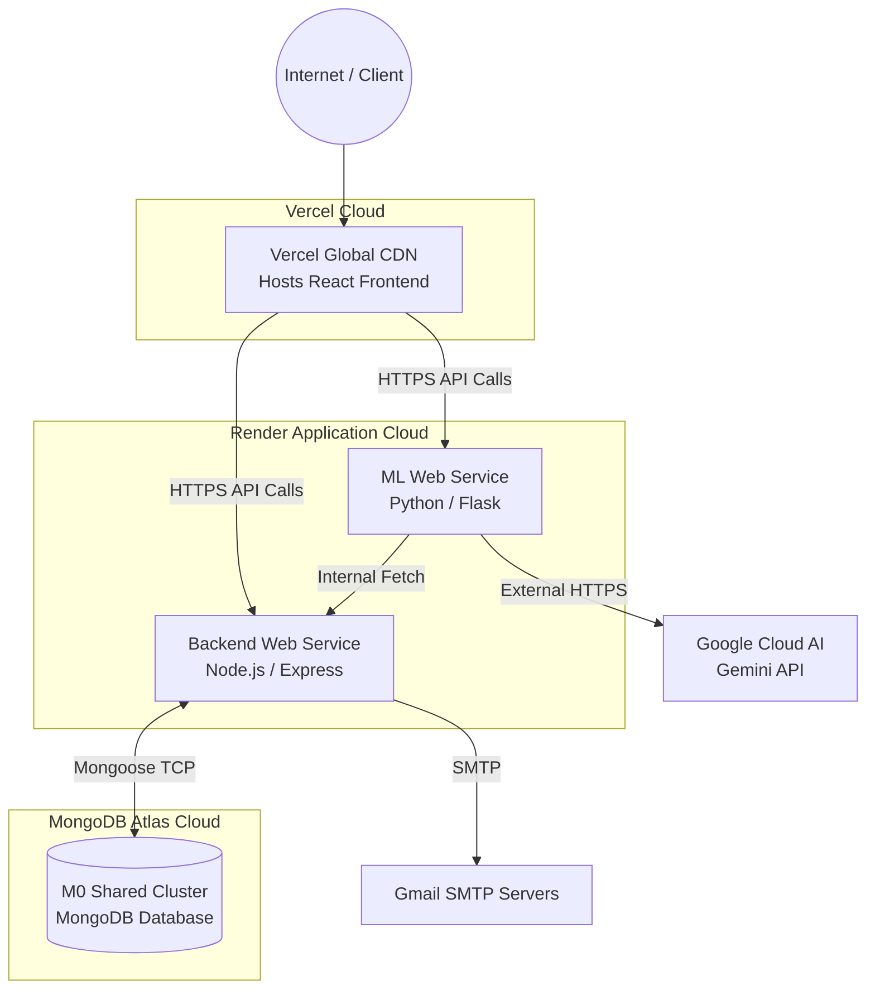

# Project Report
## Multi-Cloud Cost Monitoring Dashboard with AI-Driven FinOps Intelligence

---

## 1. Introduction

### 1.1 Project Overview
Cloud Financial Operations (FinOps) is increasingly crucial as organizations distribute their workloads across multiple cloud platforms. However, native cost management tools provided by cloud vendors (AWS, Azure, GCP) are inherently siloed. This project, VyayaDrishti, addresses this challenge by providing a unified, multi-cloud cost monitoring dashboard integrated with machine learning and agentic AI capabilities.

### 1.2 Objectives
* To aggregate simulated billing data across AWS, Azure, and GCP into a single view.
* To apply an Isolation Forest ML algorithm to detect spending anomalies autonomously.
* To provide time-series forecasting for future cloud costs.
* To implement a conversational Agentic AI FinOps assistant using Google Gemini.
* To facilitate automated budget management and alerting via email notifications.

---

## 2. System Architecture

The application is built on a microservices architecture to ensure scalability and independent deployment of the machine learning and presentation layers.

### 2.1 Technology Stack
* **Frontend Layer**: React 18, Vite, Recharts, deployed on Vercel.
* **Backend API**: Node.js, Express.js, deployed on Render.
* **Data Storage**: MongoDB Atlas (Cloud), Mongoose ODM.
* **Machine Learning**: Python 3.12, Flask, scikit-learn (Isolation Forest).
* **Agentic AI**: Google Gemini API with native function calling.
* **Alerting**: Nodemailer for automated email notifications.
* **Containerization**: Docker and Docker Compose for orchestration.

### 2.2 System Modules
1. **Data Aggregation Engine**: Simulates and normalizes 6 months of realistic billing data across 18 core services from three major cloud providers.
2. **Dashboard & Cost Explorer**: Interactive UI providing KPI summaries, daily cost trends, and drill-down capabilities by provider, service, and region.
3. **ML Anomaly Detection**: An unsupervised machine learning service that learns normal spending patterns and automatically flags unusual cost spikes without requiring manual threshold configuration.
4. **Agentic AI Chatbot**: A natural-language interface that leverages the ReAct pattern. The agent has autonomous access to database query tools, allowing it to retrieve real cost data and provide specific insights rather than generic advice.
5. **Budget & Alerting Module**: Allows creation of spending limits with color-coded gauge charts. Automated email notifications are sent via Gmail SMTP when spending thresholds are breached.
6. **Report Generation**: Facilitates the export of cost data as formatted PDF documents and CSV files for stakeholder distribution.

---

## 3. Implementation Highlights

### 3.1 Data Normalization
A significant challenge in multi-cloud cost management is the variance in billing terminology. The project successfully normalizes data from AWS (e.g., EC2), Azure (e.g., Virtual Machines), and GCP (e.g., Compute Engine) into a unified MongoDB schema, enabling seamless cross-provider aggregation.

### 3.2 Agentic AI Integration
Unlike traditional RAG (Retrieval-Augmented Generation) implementations, this project utilizes function calling. The Gemini model is provided with a schema of available APIs (e.g., `get_top_services`, `detect_anomalies`). When a user asks a question, the model determines which function to call, waits for the backend to execute the query against MongoDB, and then structures the final response based on the live data.

### 3.3 Anomaly Detection
The Isolation Forest algorithm was chosen over static rules due to its ability to identify anomalies in high-dimensional datasets without requiring labeled training data. The model effectively isolates anomalies (like simulated random cost spikes) by recognizing data points that are "few and different".

---

## 4. Limitations and Future Scope

### 4.1 Current Limitations
* **Simulated Data**: The current iteration uses programmatically generated data to simulate cloud billing.
* **Model Training Time**: The anomaly detection model requires at least 30 days of historical data to establish a reliable baseline.
* **Single Tenant**: The application architecture is designed for a single organization and lacks role-based access control.

### 4.2 Future Enhancements
* **Live API Integration**: Replacing the simulation engine with live connections to AWS Cost Explorer, Azure Cost Management, and GCP Billing APIs.
* **Container Cost Allocation**: Integrating with tools like Kubecost to provide visibility into Kubernetes namespace-level spending.
* **Action Automation**: Allowing the AI agent to not only read data but autonomously execute cost-saving measures (e.g., terminating idle EC2 instances) after requiring user confirmation.

---

## 5. Conclusion
VyayaDrishti demonstrates that enterprise-grade Cloud FinOps capabilities can be built using open-source technologies and free-tier services. By unifying data visibility, automating anomaly detection, and introducing a natural language interface for cost analysis, the system shifts cloud cost management from a reactive, manual process to a proactive, intelligent operation.

---

## 6. Architecture & Flow Diagrams

### 6.1 Overall Architecture of VyayaDrishti

### 6.2 Data Flow Diagram (Level 0)

### 6.3 Data Flow Diagram (Level 1)

### 6.4 Database / Data Model

### 6.5 Synthetic Billing Data Generation Pipeline

### 6.6 Isolation Forest Anomaly Detection Pipeline

### 6.7 Gemini AI Assistant Processing Flow

### 6.8 Deployment Architecture

