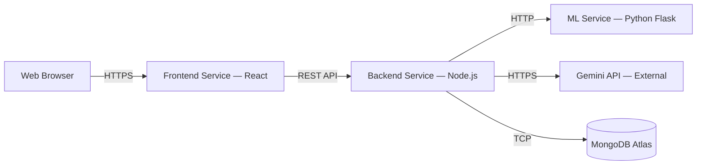
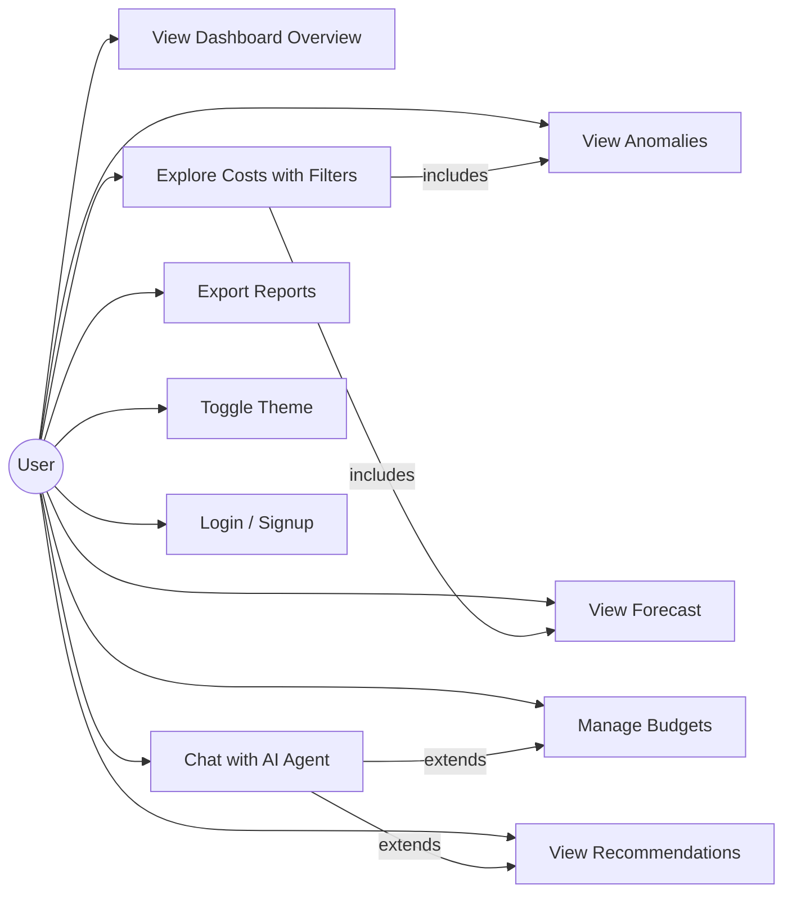
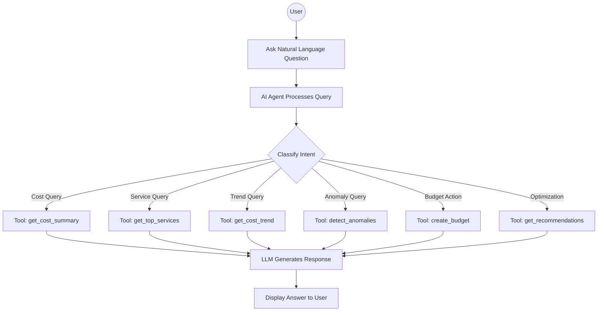
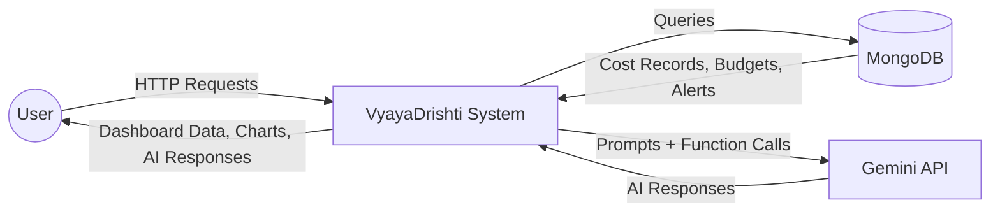
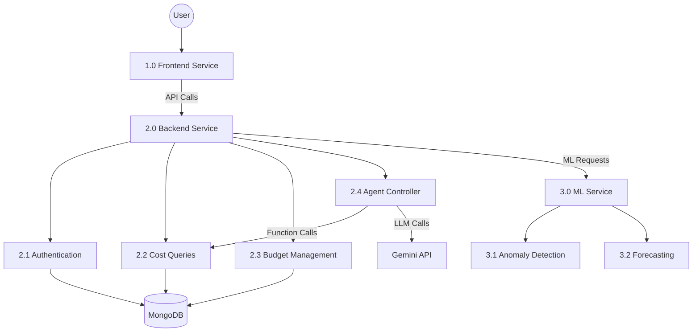
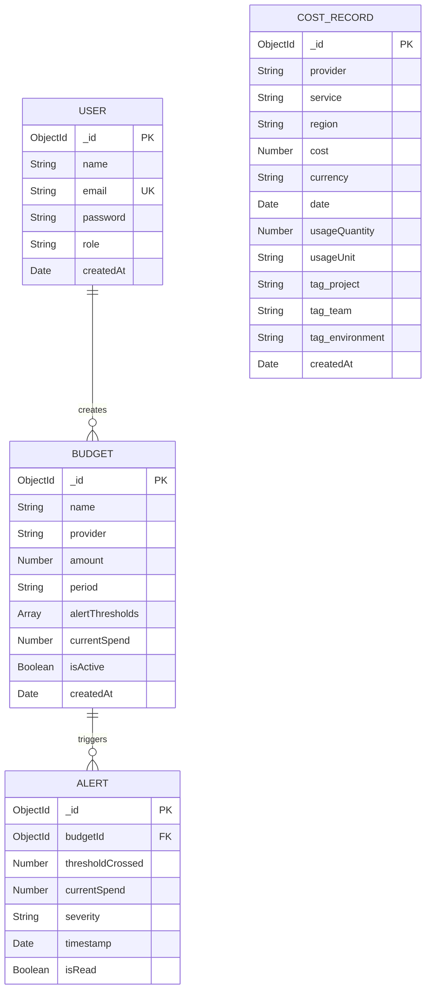

# Software Requirements Specification (SRS)

## Multi-Cloud Cost Monitoring Dashboard with AI-Driven FinOps Intelligence

**Version**: 1.0  
**Date**: June 18, 2026  
**Standard**: Based on IEEE 830-1998

---

## Table of Contents

1. [Introduction](#1-introduction)
2. [Overall Description](#2-overall-description)
3. [System Features & Functional Requirements](#3-system-features--functional-requirements)
4. [External Interface Requirements](#4-external-interface-requirements)
5. [Non-Functional Requirements](#5-non-functional-requirements)
6. [Data Dictionary](#6-data-dictionary)
7. [Use Case Diagrams](#7-use-case-diagrams)
8. [Data Flow Diagrams](#8-data-flow-diagrams)
9. [ER Diagram](#9-er-diagram)
10. [Acceptance Criteria](#10-acceptance-criteria)
11. [Appendix](#11-appendix)

---

## 1. Introduction

### 1.1 Purpose

This Software Requirements Specification (SRS) document provides a complete description of the functional and non-functional requirements for the **Multi-Cloud Cost Monitoring Dashboard with AI-Driven FinOps Intelligence** (hereafter referred to as **VyayaDrishti**). This document is intended for:

- Development team members (4 persons)
- IBM internship mentors and evaluators
- Project stakeholders and reviewers

### 1.2 Scope

VyayaDrishti is a web-based application that provides:
- Unified cloud cost monitoring across AWS, Azure, and GCP
- Machine learning-based anomaly detection and cost forecasting
- An agentic AI chatbot for natural language cost analysis
- Budget management, optimization recommendations, and report generation

The system will **NOT**:
- Connect to live cloud provider billing APIs (simulated data)
- Provide real-time streaming data processing
- Support multi-organization tenancy
- Provide mobile native applications

### 1.3 Definitions, Acronyms, and Abbreviations

| Term | Definition |
|---|---|
| **FinOps** | Cloud Financial Operations — practice of managing cloud costs |
| **Agentic AI** | AI systems that can autonomously reason, plan, and execute actions using external tools |
| **Function Calling** | LLM capability to invoke external functions/APIs to retrieve or modify data |
| **Isolation Forest** | Unsupervised ML algorithm for anomaly detection based on random partitioning |
| **Prophet** | Open-source time-series forecasting library by Meta |
| **KPI** | Key Performance Indicator |
| **JWT** | JSON Web Token — standard for secure authentication |
| **REST** | Representational State Transfer — API architectural style |
| **RAG** | Retrieval-Augmented Generation — enhancing LLM responses with external data |
| **CRUD** | Create, Read, Update, Delete — basic data operations |
| **LLM** | Large Language Model |

### 1.4 References

1. IEEE Std 830-1998, "Recommended Practice for Software Requirements Specifications"
2. FinOps Foundation, "FinOps Framework," [finops.org](https://www.finops.org)
3. Google, "Gemini API Documentation," [ai.google.dev](https://ai.google.dev)
4. scikit-learn, "Isolation Forest," [scikit-learn.org](https://scikit-learn.org)

---

## 2. Overall Description

### 2.1 Product Perspective

VyayaDrishti is a standalone web application built on a microservice architecture. It consists of three independently deployable services:



### 2.2 Product Functions (High-Level)

| # | Function | Description |
|---|---|---|
| F1 | Cost Aggregation | Consolidate cost data from 3 cloud providers into a unified view |
| F2 | Data Visualization | Display cost data through interactive charts and KPI cards |
| F3 | Cost Exploration | Filter, drill-down, and compare costs across dimensions |
| F4 | Anomaly Detection | Automatically identify unusual cost patterns using ML |
| F5 | Cost Forecasting | Predict future costs with confidence intervals |
| F6 | AI Chat Interface | Natural language queries and actions via agentic chatbot |
| F7 | AI Insights | Auto-generated natural language cost summaries |
| F8 | Budget Management | Create and monitor spending budgets with alert thresholds |
| F9 | Recommendations | Suggest cost optimization actions with savings estimates |
| F10 | Report Export | Generate and download cost reports as PDF/CSV |
| F11 | Authentication | Secure user login/signup with JWT tokens |

### 2.3 User Classes and Characteristics

| User Class | Description | Technical Level | Primary Functions Used |
|---|---|---|---|
| **FinOps Analyst** | Primary user — monitors and optimizes cloud costs | Medium | All functions |
| **Engineering Manager** | Reviews costs for their team's cloud usage | Low-Medium | F1, F2, F3, F6, F10 |
| **CTO / VP Engineering** | Executive overview of cloud spending | Low | F1, F2, F6, F7, F10 |
| **DevOps Engineer** | Investigates cost spikes related to infrastructure | High | F3, F4, F5, F6, F9 |

### 2.4 Operating Environment

| Component | Requirement |
|---|---|
| **Client Browser** | Chrome 90+, Firefox 90+, Safari 15+, Edge 90+ |
| **Screen Resolution** | Minimum 375px (mobile) to 2560px (ultrawide) |
| **Frontend Hosting** | Vercel (Node.js 18+ runtime) |
| **Backend Hosting** | Render (Node.js 18+ runtime) |
| **ML Service Hosting** | Render or PythonAnywhere (Python 3.10+) |
| **Database** | MongoDB Atlas (M0 Free Tier — 512 MB) |
| **External API** | Google Gemini API (Free Tier — 60 RPM) |

### 2.5 Design and Implementation Constraints

1. All data is simulated — no live cloud API integration
2. Gemini API free tier limits: 60 requests/minute, 1500 requests/day
3. MongoDB Atlas free tier: 512 MB storage, 100 connections
4. Render free tier: services spin down after 15 minutes of inactivity
5. All communication between services uses REST over HTTP/HTTPS
6. Frontend must be fully responsive (mobile to desktop)
7. Dark theme is the default and primary design

### 2.6 Assumptions and Dependencies

**Assumptions:**
- Users have a modern web browser with JavaScript enabled
- Users have basic understanding of cloud cost concepts
- Internet connectivity is available (for API calls to Gemini and MongoDB Atlas)

**Dependencies:**
- Google Gemini API availability and free tier continuity
- MongoDB Atlas free tier availability
- npm package ecosystem stability
- Python package ecosystem stability (scikit-learn, Flask)

---

## 3. System Features & Functional Requirements

### 3.1 Module 1: Data Aggregation & Simulation

#### FR-1.1: Mock Data Generation
| Field | Specification |
|---|---|
| **ID** | FR-1.1 |
| **Priority** | High |
| **Description** | System shall generate realistic billing data for AWS (7 services), Azure (6 services), and GCP (5 services) covering 6 months of historical data |
| **Input** | Seed command (`npm run seed`) |
| **Processing** | Generate daily cost records with realistic patterns: weekday/weekend variation, monthly growth (~8%), random anomaly spikes (2% probability) |
| **Output** | ~19,800 cost records inserted into MongoDB |
| **Validation** | Each record must have: provider, service, region, cost (>0), date, usage quantity, tags |

#### FR-1.2: Data Normalization
| Field | Specification |
|---|---|
| **ID** | FR-1.2 |
| **Priority** | High |
| **Description** | All cost records shall follow a unified schema regardless of cloud provider |
| **Schema Fields** | provider (enum), service (string), region (string), cost (number), currency (string), date (date), usageQuantity (number), usageUnit (string), tags (object) |

#### FR-1.3: Data Aggregation Queries
| Field | Specification |
|---|---|
| **ID** | FR-1.3 |
| **Priority** | High |
| **Description** | System shall support aggregation by: provider, service, region, date range, tags (project, team, environment) |
| **Response Time** | Aggregation queries shall complete within 2 seconds |

---

### 3.2 Module 2: Dashboard & Visualization

#### FR-2.1: Overview Page
| Field | Specification |
|---|---|
| **ID** | FR-2.1 |
| **Priority** | High |
| **Description** | Display 6 KPI cards: Total Spend, AWS Spend, Azure Spend, GCP Spend, Budget Utilization (%), Active Alerts count |
| **Data Source** | `GET /api/costs/summary` |
| **Update Frequency** | On page load and manual refresh |

#### FR-2.2: KPI Cards
| Field | Specification |
|---|---|
| **ID** | FR-2.2 |
| **Priority** | High |
| **Description** | Each KPI card shall display: label, current value (formatted with $ and commas), month-over-month percentage change with directional arrow (↑/↓), and a color-coded accent bar per provider |

#### FR-2.3: Chart Components
| Field | Specification |
|---|---|
| **ID** | FR-2.3 |
| **Priority** | High |
| **Description** | System shall provide 7 reusable chart components |

| Chart | Type | Data Source | Interactive Features |
|---|---|---|---|
| SpendLineChart | Line | Daily costs | Hover tooltips, anomaly markers |
| ServiceDonutChart | Donut | Cost by service | Click to filter |
| ProviderBarChart | Stacked Bar | Cost by provider per month | Hover tooltips |
| TrendAreaChart | Area | Monthly trend | Gradient fill, forecast extension |
| RegionBarChart | Horizontal Bar | Cost by region | Hover tooltips |
| BudgetGaugeChart | Radial Gauge | Budget utilization % | Color thresholds |
| SparklineChart | Mini Line | Trend in KPI cards | No interaction |

#### FR-2.4: Cost Explorer Page
| Field | Specification |
|---|---|
| **ID** | FR-2.4 |
| **Priority** | High |
| **Description** | Interactive page with main time-series chart, service breakdown, provider comparison, and region analysis |
| **Filters** | Provider (dropdown: All/AWS/Azure/GCP), Date range (date picker: from/to), Service (dropdown, dynamic based on provider) |
| **Behavior** | Changing any filter updates all charts simultaneously |

#### FR-2.5: Responsive Design
| Field | Specification |
|---|---|
| **ID** | FR-2.5 |
| **Priority** | Medium |
| **Description** | Dashboard shall be fully responsive |
| **Breakpoints** | Mobile: ≤768px (stacked layout, collapsed sidebar), Tablet: 769-1024px (2-column grid), Desktop: ≥1025px (full layout with sidebar) |

#### FR-2.6: Dark Theme
| Field | Specification |
|---|---|
| **ID** | FR-2.6 |
| **Priority** | Medium |
| **Description** | Default theme shall be dark with CSS variables. Light theme toggle available in Settings. |

---

### 3.3 Module 3: ML Anomaly Detection

#### FR-3.1: Anomaly Detection Model
| Field | Specification |
|---|---|
| **ID** | FR-3.1 |
| **Priority** | High |
| **Description** | System shall detect cost anomalies using Isolation Forest algorithm |
| **Algorithm** | scikit-learn IsolationForest with contamination=0.05 |
| **Features Used** | cost, day_of_week, day_of_month, cost_ratio (cost / 7-day rolling average) |
| **Output** | For each data point: is_anomaly (boolean), anomaly_score (float -1 to 0) |
| **API Endpoint** | `POST /ml/anomalies` |
| **Input Payload** | `{ "cost_data": [{ "date": "YYYY-MM-DD", "cost": number }] }` |
| **Response Time** | ≤ 3 seconds for 180 days of data |

#### FR-3.2: Anomaly Visualization
| Field | Specification |
|---|---|
| **ID** | FR-3.2 |
| **Priority** | High |
| **Description** | Anomalous data points shall be highlighted on the Cost Explorer line chart as red circular markers with pulse animation |
| **Tooltip** | Show: date, cost, severity (warning/critical), deviation from average |

#### FR-3.3: Anomaly Severity Classification
| Field | Specification |
|---|---|
| **ID** | FR-3.3 |
| **Priority** | Medium |
| **Description** | Anomalies shall be classified into severity levels |
| **Levels** | Warning (anomaly_score between -0.3 and -0.15), Critical (anomaly_score < -0.3) |

---

### 3.4 Module 4: Cost Forecasting

#### FR-4.1: Cost Prediction
| Field | Specification |
|---|---|
| **ID** | FR-4.1 |
| **Priority** | High |
| **Description** | System shall forecast daily costs for the next 1-3 months |
| **Algorithm** | Linear regression (baseline) with optional Prophet enhancement |
| **Output** | Predicted cost, upper bound, lower bound (95% confidence interval) |
| **API Endpoint** | `POST /ml/forecast` |
| **Input Payload** | `{ "cost_data": [...], "months": 3 }` |
| **Response** | `{ "forecast": [...], "predicted_total": number, "trend": "increasing/decreasing", "monthly_growth_rate": number }` |

#### FR-4.2: Forecast Visualization
| Field | Specification |
|---|---|
| **ID** | FR-4.2 |
| **Priority** | Medium |
| **Description** | Forecast data shall be displayed as a dashed line extending from actual data, with a shaded confidence band (upper/lower bounds) |

---

### 3.5 Module 5: Agentic AI Chatbot

#### FR-5.1: Natural Language Chat Interface
| Field | Specification |
|---|---|
| **ID** | FR-5.1 |
| **Priority** | High |
| **Description** | System shall provide a floating chatbot widget accessible from every page |
| **UI Elements** | Floating action button (bottom-right), expandable chat window, message history, text input, send button |
| **LLM** | Google Gemini 2.0 Flash via `@google/generative-ai` SDK |

#### FR-5.2: Function Calling (Tool Use)
| Field | Specification |
|---|---|
| **ID** | FR-5.2 |
| **Priority** | High |
| **Description** | The AI agent shall have access to 6 tools it can autonomously invoke |

| Tool Name | Description | Parameters |
|---|---|---|
| `get_cost_summary` | Get total spend by provider | provider (optional) |
| `get_top_services` | Get most expensive services | provider (optional), limit |
| `get_cost_trend` | Get monthly trend | months |
| `detect_anomalies` | Find cost anomalies | provider (optional) |
| `create_budget` | Create a new budget | provider, amount, period |
| `get_recommendations` | Get optimization suggestions | provider (optional) |

#### FR-5.3: Conversational Context
| Field | Specification |
|---|---|
| **ID** | FR-5.3 |
| **Priority** | Medium |
| **Description** | Chatbot shall maintain conversation history within a session to support follow-up questions |

#### FR-5.4: System Prompt
| Field | Specification |
|---|---|
| **ID** | FR-5.4 |
| **Priority** | High |
| **Description** | Agent shall be instructed to behave as a Cloud FinOps analyst — provide specific numbers, cite data, and give actionable recommendations |

#### FR-5.5: AI-Generated Insights
| Field | Specification |
|---|---|
| **ID** | FR-5.5 |
| **Priority** | Medium |
| **Description** | System shall auto-generate 4 natural language insights displayed on the Overview page |
| **Categories** | Overview, Warning, Optimization, Forecast |
| **API Endpoint** | `GET /api/agent/insights` |
| **Update Frequency** | On Overview page load |

---

### 3.6 Module 6: Budget Management & Alerting

#### FR-6.1: Budget CRUD
| Field | Specification |
|---|---|
| **ID** | FR-6.1 |
| **Priority** | High |
| **Description** | Users shall create, view, update, and delete budgets |
| **Budget Fields** | Name, provider (AWS/Azure/GCP/all), amount ($), period (monthly/quarterly/yearly), alert thresholds (array of percentages) |
| **API Endpoints** | `GET /api/budgets`, `POST /api/budgets`, `PUT /api/budgets/:id`, `DELETE /api/budgets/:id` |

#### FR-6.2: Budget Visualization
| Field | Specification |
|---|---|
| **ID** | FR-6.2 |
| **Priority** | High |
| **Description** | Each budget shall be displayed as a gauge chart showing current spend vs. budget amount with color coding: Green (<80%), Orange (80-99%), Red (≥100%) |

#### FR-6.3: Alert Generation
| Field | Specification |
|---|---|
| **ID** | FR-6.3 |
| **Priority** | High |
| **Description** | System shall automatically generate alerts when spending crosses configured threshold percentages |
| **Alert Fields** | Budget reference, threshold crossed, current spend, timestamp, severity |

#### FR-6.4: Alert History
| Field | Specification |
|---|---|
| **ID** | FR-6.4 |
| **Priority** | Medium |
| **Description** | Display chronological list of all triggered alerts with severity icons and timestamps |

#### FR-6.5: Notification Badge
| Field | Specification |
|---|---|
| **ID** | FR-6.5 |
| **Priority** | Medium |
| **Description** | Header notification bell shall show count of unread/recent alerts as a red badge |

---

### 3.7 Module 7: Recommendation Engine

#### FR-7.1: Rule-Based Recommendations
| Field | Specification |
|---|---|
| **ID** | FR-7.1 |
| **Priority** | High |
| **Description** | System shall generate optimization recommendations based on predefined rules |

| Rule | Trigger Condition | Recommendation | Estimated Savings |
|---|---|---|---|
| Idle Resources | Service daily cost < $5 for 30+ days | Terminate idle resource | 100% of service cost |
| Right-Sizing | Compute cost > $200/day | Downsize instance type | ~30% of compute cost |
| Reserved Instances | Steady usage > 3 months | Switch to reserved pricing | ~30-40% savings |
| Storage Cleanup | Storage cost growth > 20%/month | Archive old data | ~15-25% of storage cost |
| Region Optimization | Premium region, non-latency-sensitive | Migrate to cheaper region | ~10-20% savings |

#### FR-7.2: Recommendation Display
| Field | Specification |
|---|---|
| **ID** | FR-7.2 |
| **Priority** | High |
| **Description** | Each recommendation card shows: title, description, affected provider/service, estimated monthly savings ($), priority badge (High/Medium/Low) |

#### FR-7.3: AI-Enhanced Analysis
| Field | Specification |
|---|---|
| **ID** | FR-7.3 |
| **Priority** | Medium |
| **Description** | "Analyze with AI" button sends cost data to Gemini for deeper, contextual recommendations beyond rule-based suggestions |

---

### 3.8 Module 8: Report Generation

#### FR-8.1: CSV Export
| Field | Specification |
|---|---|
| **ID** | FR-8.1 |
| **Priority** | High |
| **Description** | Export cost data for a selected date range as a CSV file |
| **Columns** | Date, Provider, Service, Region, Cost, Usage Quantity, Usage Unit, Project, Team, Environment |
| **Library** | PapaParse |

#### FR-8.2: PDF Report
| Field | Specification |
|---|---|
| **ID** | FR-8.2 |
| **Priority** | High |
| **Description** | Generate a formatted PDF report with: title, date range, summary table (per-provider totals), top 10 services table, total spend |
| **Library** | jsPDF + jsPDF-AutoTable |

#### FR-8.3: Date Range Selection
| Field | Specification |
|---|---|
| **ID** | FR-8.3 |
| **Priority** | High |
| **Description** | Reports page shall have from/to date pickers and a provider filter to scope the report |

---

### 3.9 Module 9: Authentication

#### FR-9.1: User Registration
| Field | Specification |
|---|---|
| **ID** | FR-9.1 |
| **Priority** | Medium |
| **Description** | New users can register with name, email, and password |
| **Password** | Minimum 8 characters, hashed with bcrypt (salt rounds=10) |
| **API Endpoint** | `POST /api/auth/signup` |

#### FR-9.2: User Login
| Field | Specification |
|---|---|
| **ID** | FR-9.2 |
| **Priority** | Medium |
| **Description** | Registered users can login with email and password |
| **Response** | JWT token (expires in 24 hours) |
| **API Endpoint** | `POST /api/auth/login` |

#### FR-9.3: Protected Routes
| Field | Specification |
|---|---|
| **ID** | FR-9.3 |
| **Priority** | Medium |
| **Description** | All API endpoints (except auth) shall require valid JWT in Authorization header |
| **Format** | `Authorization: Bearer <token>` |

---

## 4. External Interface Requirements

### 4.1 User Interface

#### UI-1: Page Layout
```
┌──────────────────────────────────────────────────────────┐
│ Sidebar (260px)  │  Header (64px height)                 │
│                  ├───────────────────────────────────────┤
│ VyayaDrishti     │                                       │
│                  │   Page Content Area                   │
│ ▸ Overview       │                                       │
│ ▸ Cost Explorer  │   (Charts, Cards, Tables,             │
│ ▸ Budgets        │    Forms, etc.)                       │
│ ▸ Recommendations│                                       │
│ ▸ Reports        │                                       │
│ ▸ Settings       │                                       │
│                  │                           🤖 Chat FAB │
└──────────────────┴───────────────────────────────────────┘
```

#### UI-2: Color Scheme
| Element | Color | Hex |
|---|---|---|
| Primary Background | Dark navy | #0a0e1a |
| Secondary Background | Dark gray | #111827 |
| Card Background | Dark blue-gray | #1a2035 |
| Primary Text | Light gray | #e2e8f0 |
| Secondary Text | Muted gray | #94a3b8 |
| Accent Blue | Bright blue | #3b82f6 |
| Success Green | Emerald | #10b981 |
| Danger Red | Red | #ef4444 |
| Warning Orange | Amber | #f59e0b |
| AWS Accent | Orange | #ff9900 |
| Azure Accent | Blue | #0078d4 |
| GCP Accent | Blue | #4285f4 |

#### UI-3: Typography
| Usage | Font | Weight | Size |
|---|---|---|---|
| Page Title | Inter | 700 (Bold) | 28px |
| Section Header | Inter | 600 (SemiBold) | 20px |
| Card Label | Inter | 500 (Medium) | 14px |
| KPI Value | Inter | 700 (Bold) | 32px |
| Body Text | Inter | 400 (Regular) | 14px |
| Small Text | Inter | 400 (Regular) | 12px |

### 4.2 API Interface

#### API Contract Summary

| Method | Endpoint | Request Body | Response |
|---|---|---|---|
| GET | `/api/costs/summary` | — | `{ totalSpend, aws, azure, gcp }` |
| GET | `/api/costs/daily?provider=&from=&to=` | — | `[{ date, cost }]` |
| GET | `/api/costs/by-service?provider=` | — | `[{ service, cost }]` |
| GET | `/api/costs/by-provider` | — | `[{ provider, cost }]` |
| GET | `/api/costs/trend?months=` | — | `[{ month, provider, total }]` |
| GET | `/api/budgets` | — | `[{ id, name, provider, amount, currentSpend }]` |
| POST | `/api/budgets` | `{ name, provider, amount, period, thresholds }` | `{ id, ...budget }` |
| PUT | `/api/budgets/:id` | `{ ...fields }` | `{ ...updated }` |
| DELETE | `/api/budgets/:id` | — | `{ success: true }` |
| GET | `/api/alerts` | — | `[{ id, budget, threshold, spend, timestamp }]` |
| GET | `/api/recommendations` | — | `[{ title, description, savings, priority }]` |
| POST | `/api/agent/chat` | `{ message, conversationHistory }` | `{ response, history }` |
| GET | `/api/agent/insights` | — | `[{ icon, category, text }]` |
| POST | `/ml/anomalies` | `{ cost_data: [...] }` | `[{ date, cost, is_anomaly, score }]` |
| POST | `/ml/forecast` | `{ cost_data: [...], months }` | `{ forecast, predicted_total, trend }` |
| POST | `/api/auth/signup` | `{ name, email, password }` | `{ token, user }` |
| POST | `/api/auth/login` | `{ email, password }` | `{ token, user }` |

### 4.3 Hardware Interface
No specific hardware interfaces required. The application is entirely web-based.

### 4.4 Software Interface

| External System | Interface Type | Protocol | Purpose |
|---|---|---|---|
| MongoDB Atlas | Database | TCP/TLS | Data persistence |
| Google Gemini API | REST API | HTTPS | LLM + function calling |
| Vercel | Hosting | HTTPS | Frontend deployment |
| Render | Hosting | HTTPS | Backend + ML deployment |

---

## 5. Non-Functional Requirements

### 5.1 Performance Requirements

| ID | Requirement | Target |
|---|---|---|
| NFR-P1 | Page load time (first meaningful paint) | ≤ 2 seconds |
| NFR-P2 | API response time (cost queries) | ≤ 1.5 seconds |
| NFR-P3 | ML anomaly detection response | ≤ 3 seconds (180 days of data) |
| NFR-P4 | ML forecast response | ≤ 5 seconds |
| NFR-P5 | AI chatbot response time | ≤ 8 seconds (includes LLM + tool execution) |
| NFR-P6 | Chart rendering time | ≤ 1 second |
| NFR-P7 | PDF report generation | ≤ 3 seconds |
| NFR-P8 | Concurrent users supported | ≥ 10 simultaneous users |

### 5.2 Security Requirements

| ID | Requirement |
|---|---|
| NFR-S1 | Passwords shall be hashed using bcrypt with minimum 10 salt rounds |
| NFR-S2 | API authentication via JWT with 24-hour expiration |
| NFR-S3 | Gemini API key shall be stored as environment variable, never in source code |
| NFR-S4 | MongoDB connection string shall use TLS encryption |
| NFR-S5 | CORS shall be configured to allow only the frontend origin |
| NFR-S6 | Input validation on all API endpoints to prevent injection attacks |
| NFR-S7 | `.env` files shall be listed in `.gitignore` and never committed |

### 5.3 Usability Requirements

| ID | Requirement |
|---|---|
| NFR-U1 | First-time users shall be able to navigate and understand the dashboard without training |
| NFR-U2 | All interactive elements shall have hover states and cursor feedback |
| NFR-U3 | Chart tooltips shall display formatted values ($X,XXX.XX) |
| NFR-U4 | Error states shall display user-friendly messages (not raw error codes) |
| NFR-U5 | Loading states shall show skeleton screens, not blank pages |
| NFR-U6 | AI chatbot shall provide suggested questions for new users |

### 5.4 Reliability Requirements

| ID | Requirement |
|---|---|
| NFR-R1 | Dashboard shall handle API failures gracefully (show cached data or error state) |
| NFR-R2 | Chatbot shall handle LLM timeouts with a retry mechanism (max 2 retries) |
| NFR-R3 | ML service failure shall not crash the main application — Cost Explorer works without anomaly data |
| NFR-R4 | System shall recover from MongoDB connection drops with automatic reconnection |

### 5.5 Scalability Requirements

| ID | Requirement |
|---|---|
| NFR-SC1 | Database shall handle up to 100,000 cost records without performance degradation |
| NFR-SC2 | MongoDB indexes on (provider, date) for optimized query performance |
| NFR-SC3 | Microservice architecture allows independent scaling of frontend, backend, and ML service |

### 5.6 Maintainability Requirements

| ID | Requirement |
|---|---|
| NFR-M1 | Code shall follow consistent folder structure documented in README |
| NFR-M2 | All API endpoints shall have JSDoc comments |
| NFR-M3 | React components shall follow single-responsibility principle |
| NFR-M4 | CSS shall use variables for all colors, spacing, and typography — no hardcoded values |
| NFR-M5 | Git commits shall follow conventional commit format (feat:, fix:, docs:) |

---

## 6. Data Dictionary

### 6.1 CostRecord Collection

| Field | Type | Required | Description | Example |
|---|---|---|---|---|
| _id | ObjectId | Auto | Unique identifier | 665a1b2c... |
| provider | String (enum) | Yes | Cloud provider name | "AWS" |
| service | String | Yes | Cloud service name | "EC2" |
| region | String | Yes | Deployment region | "us-east-1" |
| cost | Number | Yes | Daily cost in currency | 145.67 |
| currency | String | No | Cost currency (default: USD) | "USD" |
| date | Date | Yes | Billing date | 2026-06-01 |
| usageQuantity | Number | No | Amount of usage | 720 |
| usageUnit | String | No | Unit of usage measurement | "hours" |
| tags.project | String | No | Associated project | "web-app" |
| tags.team | String | No | Responsible team | "engineering" |
| tags.environment | String | No | Deployment environment | "production" |
| createdAt | Date | Auto | Record creation timestamp | 2026-06-01T00:00:00Z |

### 6.2 Budget Collection

| Field | Type | Required | Description | Example |
|---|---|---|---|---|
| _id | ObjectId | Auto | Unique identifier | 665a1b2c... |
| name | String | Yes | Budget display name | "AWS Monthly Budget" |
| provider | String (enum) | No | Target provider or "all" | "AWS" |
| amount | Number | Yes | Budget limit in USD | 10000 |
| period | String (enum) | No | Budget period | "monthly" |
| alertThresholds | [Number] | No | Alert trigger percentages | [80, 90, 100] |
| currentSpend | Number | No | Current period spend | 7500 |
| isActive | Boolean | No | Budget active status | true |

### 6.3 Alert Collection

| Field | Type | Required | Description | Example |
|---|---|---|---|---|
| _id | ObjectId | Auto | Unique identifier | 665a1b2c... |
| budgetId | ObjectId | Yes | Reference to Budget | ref: Budget._id |
| thresholdCrossed | Number | Yes | Which threshold was hit | 90 |
| currentSpend | Number | Yes | Spend at alert time | 9100 |
| severity | String (enum) | Yes | warning / critical | "critical" |
| timestamp | Date | Yes | When alert triggered | 2026-06-15T14:30:00Z |
| isRead | Boolean | No | User has seen it | false |

### 6.4 User Collection

| Field | Type | Required | Description | Example |
|---|---|---|---|---|
| _id | ObjectId | Auto | Unique identifier | 665a1b2c... |
| name | String | Yes | User's display name | "Ananya Karn" |
| email | String | Yes | Login email (unique) | "ananya@example.com" |
| password | String | Yes | Bcrypt hashed password | $2b$10$... |
| role | String | No | User role | "admin" |

---

## 7. Use Case Diagrams

### 7.1 Overall System Use Cases



### 7.2 AI Chatbot Use Case Detail



---

## 8. Data Flow Diagrams

### 8.1 Level 0 — Context Diagram



### 8.2 Level 1 — System Decomposition



---

## 9. ER Diagram



---

## 10. Acceptance Criteria

### 10.1 Functional Acceptance

| # | Criterion | Pass Condition |
|---|---|---|
| AC-1 | Dashboard loads with real data | Overview page shows KPI cards with non-zero values from MongoDB |
| AC-2 | Cost Explorer filters work | Changing provider filter updates all charts with filtered data |
| AC-3 | Anomaly detection works | ML endpoint returns data with is_anomaly=true for known spike records |
| AC-4 | Anomalies visible on chart | Red markers appear on line chart at anomaly dates |
| AC-5 | Forecast displays correctly | Dashed line extends beyond actual data with confidence band |
| AC-6 | AI chatbot answers questions | Ask "What is the total AWS spend?" → Get response with accurate dollar amount |
| AC-7 | AI uses function calling | Chat logs show tool invocation before response generation |
| AC-8 | Budget creation works | Create budget → Appears on Budgets page with gauge chart |
| AC-9 | Alerts trigger correctly | Budget at 90%+ spend generates an alert record |
| AC-10 | Recommendations display | At least 5 recommendations shown with savings estimates |
| AC-11 | CSV export works | Download button produces valid .csv file with cost data |
| AC-12 | PDF export works | Download button produces formatted .pdf report |
| AC-13 | Authentication works | Signup → Login → Access dashboard with token |
| AC-14 | Responsive design | Dashboard is usable on 375px mobile screen |

### 10.2 Non-Functional Acceptance

| # | Criterion | Pass Condition |
|---|---|---|
| AC-15 | Page load performance | Overview page loads in ≤ 2 seconds |
| AC-16 | API performance | Cost summary endpoint responds in ≤ 1.5 seconds |
| AC-17 | Security | Accessing API without JWT returns 401 Unauthorized |
| AC-18 | Error handling | Invalid API requests return structured error JSON, not stack traces |
| AC-19 | Deployment | Application is accessible via public URL (Vercel + Render) |

---

## 11. Appendix

### 11.1 Cloud Services Simulated

| AWS (7) | Azure (6) | GCP (5) |
|---|---|---|
| EC2 | Virtual Machines | Compute Engine |
| S3 | Blob Storage | Cloud Storage |
| RDS | SQL Database | BigQuery |
| Lambda | Functions | Cloud Functions |
| CloudFront | AKS | GKE |
| EKS | Cosmos DB | — |
| DynamoDB | — | — |

### 11.2 Regions Simulated

| AWS | Azure | GCP |
|---|---|---|
| us-east-1 | eastus | us-central1 |
| us-west-2 | westeurope | europe-west1 |
| eu-west-1 | southeastasia | asia-east1 |

### 11.3 Glossary of IBM Product Alignment

| Component | Service |
|---|---|---|
| AI / LLM | Google Gemini API |
| Database | MongoDB Atlas M0 |
| Frontend Hosting | Vercel |
| Backend Hosting | Render |
| ML Libraries | scikit-learn, Pandas, NumPy |
| Charts | Recharts |
| Forecasting | Prophet (optional) |
