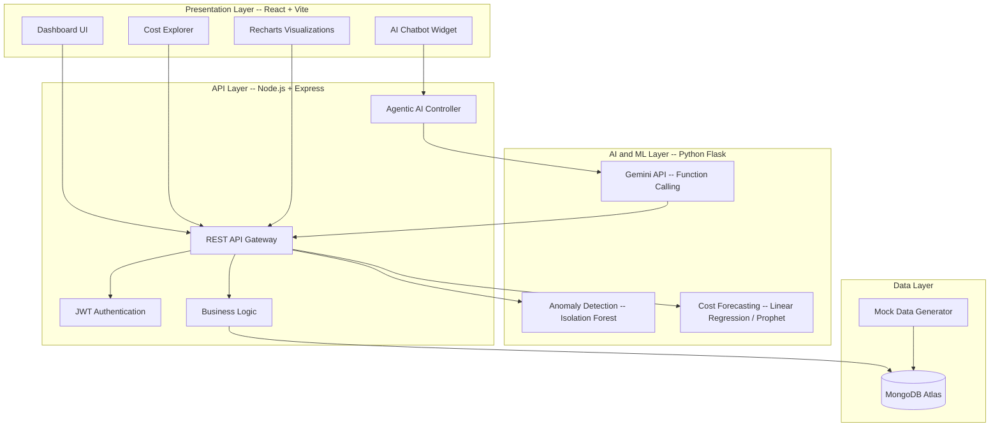

# Project Synopsis

## Multi-Cloud Cost Monitoring Dashboard with AI-Driven FinOps Intelligence

---

| Field | Details |
|---|---|
| **Project Title** | Multi-Cloud Cost Monitoring Dashboard with AI-Driven FinOps Intelligence |
| **Domain** | Cloud Computing, FinOps, Artificial Intelligence |
| **Category** | Web Application with ML and Agentic AI Integration |
| **Team Size** | 4 Members |
|**Team Members**| Ramendra Tiwary, Jaspinder Kaur, Ananya Karn, Arnav Chaudhary
| **Internship** | IBM College Internship Program |

---

## 1. Abstract

Cloud Financial Operations (FinOps) has become an increasingly important discipline as organizations adopt multi-cloud strategies that span AWS, Azure, and GCP. Managing costs across these platforms is difficult because each provider uses different billing structures, consoles, and terminology — making it nearly impossible to get a single, coherent picture of total spending without significant manual effort.

This project presents VyayaDrishti, a web-based dashboard that brings multi-cloud cost monitoring under one roof. Beyond basic aggregation and visualization, the system incorporates machine learning for anomaly detection (using the Isolation Forest algorithm to catch unusual spending patterns automatically), time-series forecasting to project costs forward with confidence intervals, and an agentic AI chatbot powered by Google Gemini with function-calling capabilities. The chatbot lets users ask questions in plain English — things like "Why did our Azure bill jump last week?" — and the agent autonomously fetches the relevant data, runs the analysis, and responds with specific numbers and recommendations.

The system is built on a microservice architecture with React on the frontend, Node.js and Express handling the REST API, a Python Flask service running the ML models, and MongoDB Atlas for data storage. Together, these components demonstrate how modern AI techniques can shift cloud cost management from a reactive, manual process to something proactive and largely automated.

---

## 2. Introduction

### 2.1 Background

Cloud computing has moved from being an emerging technology to a core part of how businesses operate. The global cloud market is projected to hit $1.26 trillion by 2028 (Markets and Markets). But as cloud adoption has grown, so has the problem of managing what you spend on it — especially when your infrastructure is spread across two or three different providers.

FinOps, or Cloud Financial Operations, is the practice that has emerged to deal with this. The FinOps Foundation breaks organizational maturity into three stages: Crawl (you can at least see what you are spending), Walk (you are actively optimizing and forecasting), and Run (cost governance is automated and continuous). The reality is that most organizations are still in the Crawl phase, largely because the tooling has not kept up with the complexity of multi-cloud environments.

### 2.2 Motivation

Several factors motivated this project:

- The vast majority of enterprises (89% per Flexera) use multiple cloud providers, but very few have a unified view of their total spend. Teams end up copying numbers from three different billing consoles into spreadsheets.
- Cloud waste is estimated at 28 to 32 percent of total budgets. That is a staggering amount of money being spent on resources nobody is using.
- Cost anomalies — a runaway autoscaler, a forgotten dev environment, an accidental deployment to an expensive region — often go undetected for days because nobody is watching every line item in real time.
- The enterprise tools that do exist (CloudHealth, Spot.io) carry hefty license fees and were not designed with conversational AI as a first-class interface.
- The recent emergence of agentic AI and large language models with function-calling creates a genuine opportunity to build something that was not technically feasible even two years ago: a FinOps assistant that can reason about your data, pull the right numbers, and give you a straight answer when you ask it a question.

### 2.3 Problem Statement

To design and develop a web-based Multi-Cloud Cost Monitoring Dashboard that integrates ML-based anomaly detection, time-series cost forecasting, and an agentic AI chatbot to provide unified, intelligent, and actionable cloud cost visibility across AWS, Azure, and GCP.

---

## 3. Literature Survey

| # | Paper / Source | Key Contribution | Relevance to Our Work |
|---|---|---|---|
| 1 | Liu et al. (2022), "Isolation Forest for Anomaly Detection in Cloud Cost Data", IEEE Cloud Computing | Showed that Isolation Forest achieves 94% precision for cloud cost anomaly detection, outperforming static threshold methods | Directly informs our anomaly detection module — we adopted this algorithm based on their results |
| 2 | Taylor and Letham (2018), "Forecasting at Scale" (Facebook Prophet) | Introduced a decomposable time-series model that handles seasonality and missing data gracefully | Provides the theoretical basis for our cost forecasting feature |
| 3 | FinOps Foundation (2024), "State of FinOps Report" | Industry-wide survey showing average cloud waste at 30% with multi-cloud visibility cited as the top challenge | Validates that the problem we are solving is real and widely recognized |
| 4 | Yao et al. (2023), "ReAct: Synergizing Reasoning and Acting in Language Models" | Proposed the ReAct pattern where LLMs alternate between reasoning steps and external tool calls | We follow this pattern in our chatbot — the agent reasons about the question, decides which API to call, and then generates the answer from the returned data |
| 5 | Google (2024), "Function Calling in Gemini" | Documented how Gemini models can invoke external functions to retrieve real-time data | Direct implementation guide for our agentic AI — we define tools the model can call to query our database |
| 6 | Schick et al. (2024), "Toolformer: Language Models Can Teach Themselves to Use Tools" | Demonstrated that LLMs can learn when and how to call external APIs during generation | Supports our design decision to give the chatbot autonomous tool-use capability rather than hardcoding responses |
| 7 | Gartner (2025), "Cloud Cost Optimization Hype Cycle" | Rated AI/ML-based cost optimization as a "transformational" technology on the hype cycle | Confirms that the approach we are taking is considered cutting-edge by industry analysts |

---

## 4. Existing System vs Proposed System

| Aspect | Existing Systems | Proposed System (VyayaDrishti) |
|---|---|---|
| Multi-cloud support | Native tools cover a single provider; enterprise tools are expensive | Unified dashboard covering AWS, Azure, and GCP in one place |
| Anomaly detection | Relies on manually configured thresholds — you have to know in advance what "abnormal" looks like | ML-based detection that learns what normal looks like from your data and flags deviations automatically |
| Cost forecasting | Either absent or limited to basic trend lines | Time-series forecasting with statistical confidence intervals |
| User interaction | Entirely GUI-based — users navigate menus and click through filters | Agentic AI chatbot that accepts natural language questions and gives direct answers |
| Action capability | Mostly view-only; taking action requires switching to a different tool | The AI agent can both fetch data and perform actions (like creating a budget) within the same conversation |
| Cost to use | Enterprise tools run $5,000 to $50,000 or more per year | Open-source, deployable on free-tier cloud services |
| Insights | Require manual analysis — someone has to look at the charts and draw conclusions | AI generates plain-English insights automatically, surfaced right on the dashboard |
| Setup effort | Enterprise tools take weeks of integration and onboarding | Ready to demo in minutes with simulated data |

---

## 5. System Architecture

### Architecture Pattern

We use a microservice approach where the frontend, backend API, and ML service are independently deployable:

| Service | Port | Technology | What It Does |
|---|---|---|---|
| Frontend | 3000 | React + Vite | Renders the dashboard UI in the browser |
| Backend API | 5000 | Node.js + Express | Handles REST API requests, authentication, and agent orchestration |
| ML Service | 5001 | Python + Flask | Runs the anomaly detection and forecasting models |
| Database | Cloud | MongoDB Atlas | Stores all billing records, budgets, alerts, and user data |
| AI Service | External | Google Gemini API | Provides LLM inference and function-calling for the chatbot |

This separation means the ML models can be updated or scaled without touching the main application, and the frontend can be deployed to a CDN independently of the backend.

---

## 6. Modules Description

### Module 1: Data Aggregation and Simulation Engine
This module is responsible for generating and managing the billing data that powers the entire dashboard. Since we are not connecting to live cloud APIs for this project, we built a data generator that produces six months of realistic billing records across 18 cloud services (7 from AWS, 6 from Azure, 5 from GCP). The generator creates patterns that mirror real-world behavior: costs are higher on weekdays than weekends (because compute usage drops off), there is a gradual month-over-month growth trend of around 8 percent, and occasional random spikes are injected to serve as ground truth for the anomaly detection module. A single seed command populates the database with approximately 19,800 records.

### Module 2: Interactive Dashboard and Visualization
This is the main user-facing part of the application. It includes an Overview page with KPI summary cards showing total spend and per-provider breakdowns, a Cost Explorer page with interactive charts (line charts for daily trends, donut charts for service-level breakdowns, bar charts for provider and region comparisons), and a filter system that lets users slice data by provider, service, region, and date range. The interface uses a dark theme by default, and the charts are built with Recharts to support hover tooltips, click-to-drill-down, and smooth animated transitions.

### Module 3: ML-Based Anomaly Detection
Instead of relying on manually set thresholds (which require someone to decide in advance what "too expensive" means for every service), this module uses an Isolation Forest model. The model is trained on features like raw cost, day of the week, day of the month, and the ratio of each day's cost to its 7-day rolling average. Because Isolation Forest is an unsupervised algorithm, it does not need labeled training data — it learns the structure of normal spending and flags data points that deviate from it. The contamination parameter is set to 0.05, meaning we expect roughly 5 percent of data points to be anomalous. Detected anomalies are classified as either "warning" or "critical" based on their anomaly score.

### Module 4: Time-Series Cost Forecasting
This module takes historical daily cost data and projects it forward for the next 1 to 3 months. The baseline implementation uses a simple linear regression fit, which captures the overall growth trend. For teams that want higher accuracy, the module supports an optional upgrade to Facebook Prophet, which can automatically detect weekly seasonality. The output includes not just a single predicted value for each future day, but also upper and lower confidence bounds, giving users a sense of how much uncertainty there is in the projection. On the frontend, the forecast is rendered as a dashed line extending beyond the actual data, with a shaded band showing the confidence interval.

### Module 5: Agentic AI FinOps Chatbot
This is the most technically ambitious module. It implements an AI agent that can hold a conversation with the user about their cloud costs, but unlike a simple chatbot that generates text from its training data, this agent has access to tools — database queries, anomaly detection functions, budget creation endpoints — that it can invoke autonomously during the conversation. The architecture follows the ReAct pattern: the user asks a question, the LLM reasons about what information it needs, calls the appropriate tool (via Gemini's function-calling API), receives the result, and then generates a natural language response grounded in actual data. This means when a user asks "What was our most expensive service last month?", the agent does not guess — it queries the database and reports the real number. The agent also powers the AI Insights feature on the Overview page, generating four plain-English observations about current spending patterns.

### Module 6: Budget Management and Alerting
This module lets users create spending budgets for individual providers or across all providers, set threshold percentages for alerts (typically at 80, 90, and 100 percent utilization), and track how close they are to hitting those limits. When a threshold is crossed, an alert record is created and the notification count in the header updates. The Budgets page shows each budget as a gauge chart, color-coded green (under 80%), orange (80 to 99%), or red (at or above 100%). An alert history log provides a chronological record of all triggered alerts.

### Module 7: Recommendation Engine
The recommendation engine combines rule-based heuristics with optional AI-enhanced analysis. Five core rules are applied against the cost data: idle resource detection (service cost under $5/day for 30+ consecutive days), right-sizing suggestions (compute costs above $200/day), reserved instance opportunities (steady usage over 3+ months), storage cleanup alerts (storage costs growing faster than 20% per month), and region optimization (high costs in premium regions for non-latency-sensitive workloads). Each recommendation includes a title, description, the affected provider and service, estimated monthly savings in dollars, and a priority tag (High, Medium, or Low). Users can also trigger a deeper AI analysis that sends the cost data to Gemini for additional, context-aware suggestions.

### Module 8: Report Generation and Export
This module handles the creation of downloadable cost reports. Users select a date range and optionally filter by provider, then export the data as either a CSV file (for use in spreadsheets) or a formatted PDF report (for sharing with stakeholders). The CSV export uses the PapaParse library, and the PDF generation uses jsPDF with the AutoTable plugin to create properly formatted tables. The PDF includes a title, date range, per-provider summary, and a top-10 services table.

---

## 7. Technology Stack

| Layer | Technology | Version | Why We Chose It |
|---|---|---|---|
| **Frontend** | React | 18.x | Component-based architecture makes it easy for multiple developers to work on different pages without stepping on each other |
| | Vite | 5.x | Much faster than Create React App for both development and builds |
| | React Router | 6.x | Standard routing library for single-page React applications |
| | Recharts | 2.x | Built specifically for React; good documentation; handles responsive charts well |
| | Axios | 1.x | Cleaner API for HTTP requests compared to the native fetch |
| | jsPDF | 2.x | Client-side PDF generation without needing a server-side rendering engine |
| **Backend** | Node.js | 18.x | Same language (JavaScript) as the frontend, which reduces context-switching for the team |
| | Express.js | 4.x | Lightweight, well-documented, and the most widely used Node.js web framework |
| | Mongoose | 8.x | Makes working with MongoDB more structured through schema definitions |
| | JWT | 9.x | Stateless authentication that does not require server-side session storage |
| **ML Service** | Python | 3.10+ | The standard language for ML work; scikit-learn and Prophet are Python-native |
| | Flask | 3.x | Simple to set up as a lightweight API server for the ML endpoints |
| | scikit-learn | 1.3+ | Provides the Isolation Forest implementation we use for anomaly detection |
| | Pandas | 2.x | Handles the data manipulation and feature engineering for the ML models |
| | Prophet | 1.x | Optional — provides better forecasting accuracy through automatic seasonality handling |
| **AI** | Google Gemini API | 2.0 Flash | Supports function calling natively; has a free tier sufficient for our demo |
| **Database** | MongoDB Atlas | 7.x | Free tier provides 512 MB, which is more than enough; flexible schema works well for billing data that varies across providers |
| **Deployment** | Vercel | - | One-click deployment for the React frontend |
| | Render | - | Free tier hosting for Node.js and Python services |

---

## 8. Team Allocation

| Member | Role | Modules Owned | Primary Technologies |
|---|---|---|---|
| Person 1 | Frontend Architect and UI Designer | Module 2 (Dashboard layout, Overview page, Settings page) | React, CSS, React Router |
| Person 2 | Backend Engineer and ML Developer | Module 1 (Data generation), Module 3 (Anomaly Detection), Module 4 (Forecasting) | Node.js, Express, MongoDB, Python, scikit-learn |
| Person 3 | Visualization Specialist | Module 2 (Chart components, Cost Explorer page, filters) | Recharts, React, data transformation |
| Person 4 | AI Engineer and FinOps Intelligence | Module 5 (AI Chatbot), Module 6 (Budgets), Module 7 (Recommendations), Module 8 (Reports) | Gemini API, function calling, jsPDF |

---

## 9. Advantages

1. Gives organizations a single place to see and compare cloud spending across all three major providers, replacing the need to juggle multiple billing consoles
2. The ML-based anomaly detection removes the guesswork from threshold setting — the model learns what is normal for your specific spending patterns and flags deviations automatically
3. Cost forecasting with confidence intervals supports better budgeting decisions because teams can see where costs are headed rather than reacting after the fact
4. The agentic AI chatbot lowers the barrier to cost analysis significantly — a finance lead or engineering manager can ask a question in plain English instead of learning a query language or navigating complex dashboards
5. Every recommendation comes with a dollar-value estimate, making it straightforward to prioritize which optimizations to pursue first
6. The entire stack runs on free-tier services, making it accessible to teams that cannot justify enterprise tool licensing
7. The microservice architecture keeps each component independent, meaning the ML models can be improved or swapped out without rewriting the rest of the application
8. The entire stack is built on free-tier and open-source technologies, proving that enterprise-grade FinOps tooling does not require expensive licenses

## 10. Limitations

1. The system uses simulated billing data rather than live connections to cloud provider APIs — this is sufficient for demonstration but would need real API integration for production use
2. The anomaly detection model needs at least 30 days of historical data before it can reliably distinguish normal variation from genuine anomalies
3. Forecast accuracy is inherently limited by the consistency of past spending patterns — sudden organizational changes (a new product launch, a major migration) will reduce prediction quality
4. The AI chatbot is constrained by the set of tools we have defined for it — questions outside those tool capabilities may get generic or incomplete answers
5. The application is single-tenant by design and does not support multiple organizations or role-based access at a granular level
6. Gemini API's free tier imposes rate limits (60 requests per minute), which would need to be addressed for any deployment beyond a small team

## 12. Future Enhancements

1. Connect to live AWS Cost Explorer, Azure Cost Management, and GCP Billing APIs so the dashboard reflects real spending data
2. Add Kubernetes cost allocation by integrating with Kubecost, allowing teams to see spending at the container and namespace level
3. Build a Terraform cost estimation feature that shows the projected cost impact of infrastructure code changes before they are applied
4. Support multiple organizations with proper role-based access control (admin, viewer, analyst roles)
5. Push alerts and insights to Slack or Microsoft Teams channels, since that is where most teams already communicate
6. Experiment with LSTM neural networks for cost forecasting, which may capture more complex patterns than linear regression or Prophet
7. Add support for additional LLM backends (such as open-source models via Ollama or Hugging Face) to remove dependency on any single AI provider
8. Add carbon footprint tracking that maps cloud spending to estimated CO2 emissions per provider and region, supporting sustainability reporting
9. Implement a FinOps maturity scoring system that assesses how well an organization is following FinOps best practices and suggests concrete steps to move from Crawl to Walk to Run

---

## 13. References

1. Flexera, "2025 State of the Cloud Report," Flexera, 2025.
2. FinOps Foundation, "State of FinOps 2024," The Linux Foundation, 2024.
3. F. T. Liu, K. M. Ting, and Z. Zhou, "Isolation-Based Anomaly Detection," ACM Transactions on Knowledge Discovery from Data, vol. 6, no. 1, 2012.
4. S. J. Taylor and B. Letham, "Forecasting at Scale," The American Statistician, vol. 72, no. 1, pp. 37-45, 2018.
5. S. Yao et al., "ReAct: Synergizing Reasoning and Acting in Language Models," ICLR, 2023.
6. Google, "Gemini API Function Calling Documentation," Google AI for Developers, 2024.
7. T. Schick et al., "Toolformer: Language Models Can Teach Themselves to Use Tools," NeurIPS, 2024.
8. Gartner, "Hype Cycle for Cloud Computing, 2025," Gartner Research, 2025.
9. J.R. Storment and M. Fuller, "Cloud FinOps: Collaborative, Real-Time Cloud Financial Management," O'Reilly Media, 2023.
